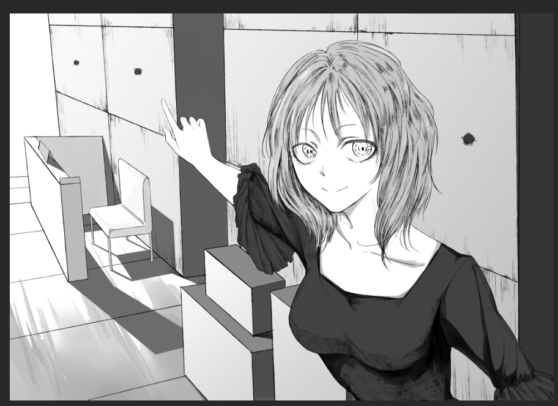

(画师：[沈山行](https://twitter.com/shanxing19991))

# 惟心馆血案

二十一世纪二十年代，黄渡大学济心学堂部分学生学习生活状况综述。

## 0. 摘要

2021 年 3 月的某一夜，从惟心馆传出的尖叫声撕裂了黄渡大学表面的祥和。

我的学妹 “张诺” 来自艺传学院，在我眼里是一位优秀的女大学生。今天主动约饭的她在春禾苑二楼告诉我前一夜发生的 “血案”。在她的撺掇下，我们一起前往惟心馆，调查死者坠楼的真相。

## 1. 缘由

* 其实是 2021 年 4 月份才开始打算写的一个题材，由于忘却的救主已经降临，我也忘记了当时是因为什么想写这么个东西；
* 由于大部分情节是做梦梦到的，一定程度上也反映了我本人的校园生活，我觉得我校园生活还算可以，所以不想忘记这一段经历。

## 2. 声明

* 该小说情节纯属虚构！同时，文中所涉及事件、情况、人物、包括但不限于餐馆的大多数地点均不存在于现实生活中！切忌对号入座！若该小说情节、事件、人物、地点与现实生活雷同或相似，纯属巧合！
* 当前大部分情节与 2021 年 4 月第一次构思时已有相当大差别，目前的情节源自 2021 年 7 月 23 日 `skyleaworlder` 的梦境。
* (2022 年 7 月 26 日续) 这半年里我看到了很多小说中的类似情节变成了现实。如有雷同，纯属巧合。

## 3. 阅读帮助

* 其实和我其他仓库一样，相信也不会有人看的；
* 如果真的要看的话，可以点 [Release](https://github.com/skyleaworlder/WeiXinCase/releases)，并在 `Assets` 中获取 `pdf` 预览版；
* 当然也可以直接点 [这里](https://github.com/skyleaworlder/WeiXinCase/releases/download/v0.01/WeiXinCase.pdf)，不过我应该很难记得改这里的链接（
* 也可以通过常规方式获得 `pdf`：

```bash
> git clone https://github.com/skyleaworlder/WeiXinCase
> cd WeiXinCase && make all
```

## 4. Why Here

* 我也知道 `GitHub` 不是干这种事的地方；
* 但想找个我一辈子都忘不了的地方放着。

## 5. 闲谈

* 可能我真的不适合写代码，我比较适合写小说；
* 但在这个过程中，感觉自己小说也写得不行；
* 35 岁退休后就找个地方写小说算了，用本科卷报告培养出来的能力糊口。
